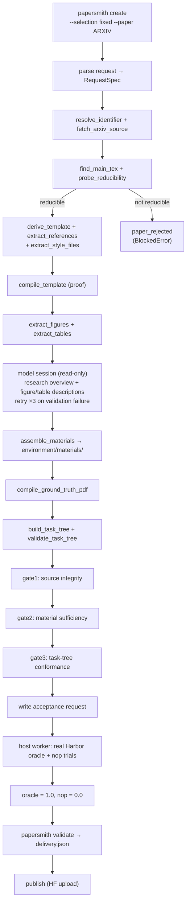

# PaperSmith

PaperSmith 把真实论文来源（arXiv）转换为可审核、可验收、可交付的科研论文写作评测任务（Harbor task），产出与 HF 数据集 `Jack-Jieke-Wu/Paper-Writing-Exam` 的 `lifesci-paperrecon-short/` 论文重建格式一致的任务树。写作 Agent 只看到题面与公开材料；真实 Harbor `oracle=1`、`nop=0` 是权威验收门槛。

当前已实现的运行时在 `src/papersmith/runtime/`：确定性控制程序 `tools/papersmith/`（Python）负责下载、解析、编译、哈希、任务树组装与验收请求；模型只以只读会话承担「研究概述 + 图表描述」和「三道独立审核」两个角色。首个任务 `lspr-0023` 已通过真实 Harbor 验收并发布到 HF。

## 一次任务如何流转

`create --selection fixed --paper <arXiv>` 走完整确定性管线；`discovery` 选择与增量 `resume` 尚未接入。



流程图源文件：`papersmith-workflow.mmd`（含任务树与运行工作区两张图）。

## 架构：确定性控制程序 + 只读模型角色

PaperSmith 不把产品逻辑集中在模型提示词里，而是分层：

| 层 | 负责什么 | 不负责什么 |
| --- | --- | --- |
| `tools/papersmith/` 控制程序 | 下载、解析、LaTeX 手术、编译、哈希、任务树组装、状态转换、验收请求 | 产品人格、自然语言流程提示 |
| 只读模型会话 | 研究概述与图表/表格描述（`materials`）、三道独立审核（`gate1/2/3`） | 写文件、下载、编译、伪造状态 |
| `runtime/` scaffold | 身份、memory policy、knowledge/skills/workflows 的领域描述 | 替代确定性校验器或隐藏失败 |

模型可以理解请求、组织材料、做科学判断；控制程序必须负责下载、解析、复制、哈希、编译和状态转换。工具接口返回结构化结果与证据路径，模型的一句「完成」不算状态。

## 交付任务树

每个交付任务满足 30 个必填路径（`contract.REQUIRED_PATHS`），结构如下（详见 `papersmith-workflow.mmd`）：

```text
tasks/<slug>/
├── task.toml
├── instruction.md
├── environment/
│   ├── Dockerfile
│   ├── materials/
│   │   ├── research_overview.md      # 公开：研究概述
│   │   ├── references.bib            # 公开：固定引用
│   │   ├── template.tex              # 公开：可编译模板
│   │   ├── figure_summary.txt        # 公开：图描述
│   │   ├── table_summary.txt         # 公开：表描述
│   │   ├── table_inventory.json      # 公开：表清单（id/行号/环境/caption/label/sha256）
│   │   ├── AGENTS.md
│   │   ├── figures/  tables/  code/
│   └── texmf/                        # 提取的 .sty/.bst 等
├── solution/
│   ├── solve.sh  normalize.py
│   └── private/  main.tex  main.pdf  config.yaml
└── tests/
    ├── Dockerfile  test.sh  test_state.py  grader_pwb.py
    ├── texmf/
    └── private/  ground_truth.tex  research_overview_long.md
                  source_manifest.json  figure_summary.txt  table_summary.txt
                  ground_truth_sources/
```

公开范围只含 `environment/`、`instruction.md`、`task.toml`；`solution/` 与 `tests/private/` 是私有依据，不进入写作 Agent 上下文（`contract.PUBLIC_ROOTS` / `PRIVATE_MARKERS` 保证公开文件不泄漏私有标记）。

## 验收与交付

三道审核 gate 只作为**记录在案的证据**，不硬阻塞；真实 Harbor 试跑由宿主机受信 worker 执行：

```text
控制容器 → docker/run-acceptance-worker.sh → Harbor oracle/nop 试跑 → 只读 receipt.json
```

- 每道任务必须真实得到 `oracle=1.0`、`nop=0.0`。
- `papersmith validate` 校验 receipt 与请求哈希一致后，组装并写回 `delivery.json`（绑定任务、gate 证据、oracle/nop 回执及指纹）。
- 镜像启动成功、模板编译成功、模型自报通过都不是验收证据。

## 发布

发布目标：HF 数据集 `Jack-Jieke-Wu/Paper-Writing-Exam`，布局 `lifesci-paperrecon-short/lspr-NNNN`。当前已发布 `lspr-0023`（论文 `arXiv:2601.02265`，oracle=1 / nop=0）。上传前 `papersmith validate` 必须返回 valid；`dataset-manifest.jsonl` 追加新条目。

用户操作见 [USER.md](USER.md)，实现、测试与发布规则见 [DEV.md](DEV.md)。
